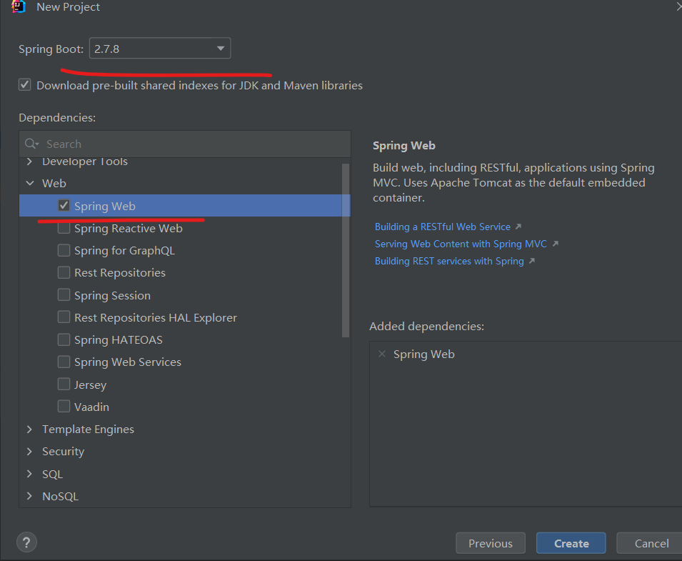
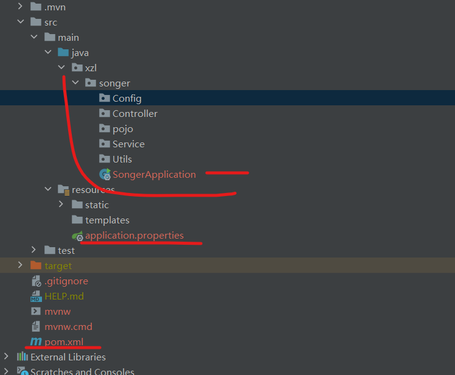

# Springboot学习

## 1 项目创建


> 项目type 选择 Maven
>
> JDK 选择1.8
>
> Java 选择 8




> 依赖有很多，先选择这个，后续的直接在文件里补充。
>
> 版本号可以选择老版。

## 2 目录结构



> 一些包需要创建
>
> XXXApplication 是启动入口
>
> 后缀propertis 是一些配置（启动端口，数据库等。。）
>
> pom.xml 是依赖配置。

`SpringBoot` 中的常用模块
`pojo`层：将数据库中的表对应成`Java`中的`Class`
`mapper`层（也叫Dao层）：将`pojo`层的`class`中的操作，映射成sql语句
`service`层：写具体的业务逻辑，组合使用`mapper`中的操作
`controller`层：负责请求转发，接受页面过来的参数，传给`Service`处理，接到返回值，再传给页面


## 3 依赖配置

Maven仓库地址 https://mvnrepository.com/
Mybatis-Plus官网 https://baomidou.com/
在`pom.xml`文件中添加依赖：


| 依赖 | 解释 |
| :--: | :--: |
|`Spring Boot Starter JDBC` |数据库配置需要的依赖 |
|`Project Lombok` |  简化class的书写，比如一些构造函数 |
|`MySQL Connector/J` |  Mysql 专用的连接依赖 |
|`mybatis-plus-boot-starter` | 数据库的转换操作（见mybatis Plus |
|`mybatis-plus-generator` | 同上 |
|`spring-boot-starter-security` | 用户验证依赖 |
|`jjwt-api` | jwt模块1 |
|`jjwt-impl` | jwt模块2 |
|`jjwt-jackson` | jwt模块3 |
|`JetBrains Java Annotations` | `org.jetbrains.annotations.NotNull` 爆红问题(爆红时需要) |

在`application.properties`中添加数据库配置：

````c
spring.datasource.username=root
spring.datasource.password=123456
spring.datasource.url=jdbc:mysql://localhost:3306/kob?serverTimezone=Asia/Shanghai&useUnicode=true&characterEncoding=utf-8
spring.datasource.driver-class-name=com.mysql.cj.jdbc.Driver
````

> 数据库的配置可以用docker
>
> [Ubuntu Docker 安装 | 菜鸟教程 (runoob.com)](https://www.runoob.com/docker/ubuntu-docker-install.html)
>
> [Docker 安装 MySQL | 菜鸟教程 (runoob.com)](https://www.runoob.com/docker/docker-install-mysql.html)

