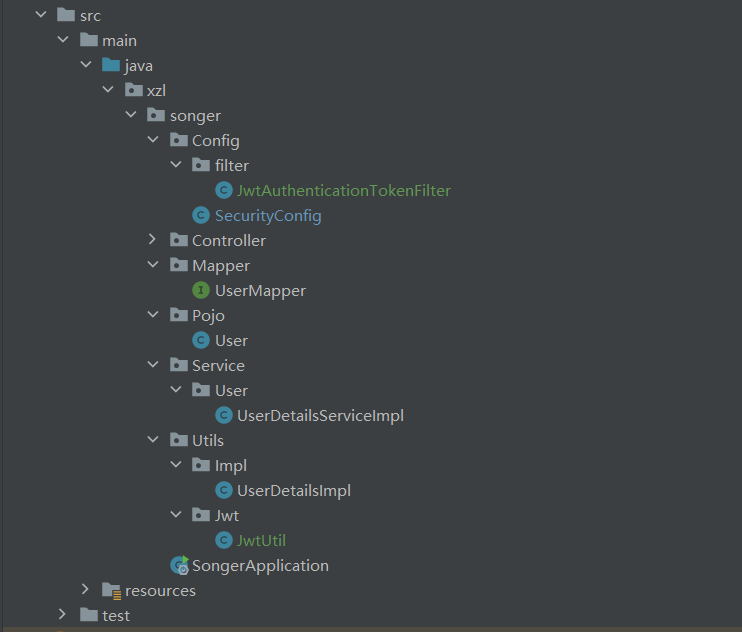

# 用户登录与处理方法

整合security与jwt进行处理。


## 流程理解

#### 登录：

1. 接受用户名，密码
2. 进行鉴权（`Authenticate`）
3. 根据用户ID生成`JWTtoken`
4. 返回`JWTtoken`，后续根据`JWT`获取用户信息（用户请求时需要携带`JWTtoken`）


#### 鉴权：

1. 获取`JWTtoken`，进行鉴定。（这一步，jwt会将鉴定后用户信息注册到当前线程）
2. 获取用户`id`
3. 根据用户ID进行操作。


#### 注册

 将信息写入数据库即可。


## 实现一些接口

security用户接口，需要对接数据库。

这些类对与authenticate都有联系，`authenticationManager.authenticate()`会调用 `UserDetailsService` (鉴权策略)

##### 1， 实现 `UserDetailsServiceImpl` 类。

实现自 `UserDetailsService` 接口,用来接入数据库信息（这是个Service）

````java
package xzl.songer.Service.User;

import com.baomidou.mybatisplus.core.conditions.query.QueryWrapper;
import org.springframework.beans.factory.annotation.Autowired;
import org.springframework.security.core.userdetails.UserDetails;
import org.springframework.security.core.userdetails.UserDetailsService;
import org.springframework.security.core.userdetails.UsernameNotFoundException;
import org.springframework.stereotype.Service;
import xzl.songer.Mapper.UserMapper;
import xzl.songer.Pojo.User;
import xzl.songer.Utils.Impl.UserDetailsImpl;

@Service
public class UserDetailsServiceImpl implements UserDetailsService {

    @Autowired
    private UserMapper userMapper;
    @Override
    public UserDetails loadUserByUsername(String username) throws UsernameNotFoundException {
        QueryWrapper<User> queryWrapper = new QueryWrapper<>();
        queryWrapper.eq("name", username);
        User user = userMapper.selectOne(queryWrapper);
        if (user == null) {
            throw new RuntimeException("用户名不存在");
        }

        return new UserDetailsImpl(user);
    }
}

````


##### 2，实现 `UserDetailsImpl` 类

实现自 `UserDetails` 接口（User外的一层壳）

````java
package xzl.songer.Utils.Impl;

import lombok.AllArgsConstructor;
import lombok.Data;
import lombok.NoArgsConstructor;
import org.springframework.security.core.GrantedAuthority;
import org.springframework.security.core.userdetails.UserDetails;
import xzl.songer.Pojo.User;

import java.util.Collection;

@Data
@AllArgsConstructor
@NoArgsConstructor
public class UserDetailsImpl implements UserDetails {

    private User user;
    @Override
    public Collection<? extends GrantedAuthority> getAuthorities() {
        return null;
    }

    @Override
    public String getPassword() {
        return user.getPwd();
    }

    @Override
    public String getUsername() {
        return user.getName();
    }

    @Override
    public boolean isAccountNonExpired() {
        return true;
    }

    @Override
    public boolean isAccountNonLocked() {
        return true;
    }

    @Override
    public boolean isCredentialsNonExpired() {
        return true;
    }

    @Override
    public boolean isEnabled() {
        return true;
    }
}

````


##### 3. 进行Security配置

实现`config.SecurityConfig`类

主要是进行密码加密

````java
@Configuration
@EnableWebSecurity
public class SecurityConfig {

    @Bean
    public PasswordEncoder passwordEncoder() {
        return new BCryptPasswordEncoder();
    }
}
````


到此可以进行数据库对接登录。

## Jwt对接

#### 1.  实现 `JwtUtil ` 类

不用改

````java
package xzl.songer.Utils.Jwt;

import io.jsonwebtoken.Claims;
import io.jsonwebtoken.JwtBuilder;
import io.jsonwebtoken.Jwts;
import io.jsonwebtoken.SignatureAlgorithm;
import org.springframework.stereotype.Component;

import javax.crypto.SecretKey;
import javax.crypto.spec.SecretKeySpec;
import java.util.Base64;
import java.util.Date;
import java.util.UUID;

@Component
public class JwtUtil {
    public static final long TTL_minute = 5L; // 有效期5分钟---自定义
    public static final long JWT_TTL = 1000L * 60 * TTL_minute;
    public static final String JWT_KEY = "FFTgjhKJiNHJPOfghj834343AruroloveSonger1314883en";
    // 密钥，数字，大小写字母，要够长
    public static String getUUID() {
        return UUID.randomUUID().toString().replaceAll("-", "");
    }

    public static String createJWT(String subject) { 
        // 根据一个sub串(关键信息)生成JWTtoken
        // sub串一般是关键信息，比如用户id
        JwtBuilder builder = getJwtBuilder(subject, null, getUUID());
        return builder.compact();
    }

    private static JwtBuilder getJwtBuilder(String subject, Long ttlMillis, String uuid) { 
        SignatureAlgorithm signatureAlgorithm = SignatureAlgorithm.HS256;
        SecretKey secretKey = generalKey();
        long nowMillis = System.currentTimeMillis();
        Date now = new Date(nowMillis);
        if (ttlMillis == null) {
            ttlMillis = JwtUtil.JWT_TTL;
        }

        long expMillis = nowMillis + ttlMillis;
        Date expDate = new Date(expMillis);
        return Jwts.builder()
                .setId(uuid)
                .setSubject(subject) // jwt的subject 包含关键信息
                .setIssuer("sg")
                .setIssuedAt(now)
                .signWith(signatureAlgorithm, secretKey)
                .setExpiration(expDate);
    }

    public static SecretKey generalKey() { // 一些加密方式
        byte[] encodeKey = Base64.getDecoder().decode(JwtUtil.JWT_KEY);
        return new SecretKeySpec(encodeKey, 0, encodeKey.length, "HmacSHA256");
    }

    public static Claims parseJWT(String jwt) throws Exception { // 解码
        SecretKey secretKey = generalKey();
        return Jwts.parserBuilder()
                .setSigningKey(secretKey)
                .build()
                .parseClaimsJws(jwt)
                .getBody();
    }
}

````


#### 2. 实现 `JwtAuthenticationTokenFilter` 类

`config.filter.JwtAuthenticationTokenFilter `类

````java
package xzl.songer.Config.filter;


import io.jsonwebtoken.Claims;
import org.jetbrains.annotations.NotNull;
import org.springframework.beans.factory.annotation.Autowired;
import org.springframework.security.authentication.UsernamePasswordAuthenticationToken;
import org.springframework.security.core.context.SecurityContextHolder;
import org.springframework.stereotype.Component;
import org.springframework.util.StringUtils;
import org.springframework.web.filter.OncePerRequestFilter;
import xzl.songer.Mapper.UserMapper;
import xzl.songer.Pojo.User;
import xzl.songer.Utils.Impl.UserDetailsImpl;
import xzl.songer.Utils.Jwt.JwtUtil;

import javax.servlet.FilterChain;
import javax.servlet.ServletException;
import javax.servlet.http.HttpServletRequest;
import javax.servlet.http.HttpServletResponse;
import java.io.IOException;

@Component
public class JwtAuthenticationTokenFilter extends OncePerRequestFilter {
    @Autowired
    private UserMapper userMapper; // 注入数据库操作器

    @Override
    protected void doFilterInternal(HttpServletRequest request, @NotNull HttpServletResponse response, @NotNull FilterChain filterChain) throws ServletException, IOException {
        String token = request.getHeader("Authorization");
		/*
		要求请求包含的头部信息：
		Authorization: "Bearer " + token
		*/
        if (!StringUtils.hasText(token) || !token.startsWith("Bearer ")) {
            filterChain.doFilter(request, response);
            return;
        }

        token = token.substring(7); // 取出真正的token

        String userid;
        try {
            Claims claims = JwtUtil.parseJWT(token); // 解码
            userid = claims.getSubject(); // 取出用户id
        } catch (Exception e) {
            throw new RuntimeException(e);
        }

        User user = userMapper.selectById(Integer.parseInt(userid)); // 根据用户id取出用户信息

        if (user == null) {
            throw new RuntimeException("用户名异常");
        }

        UserDetailsImpl loginUser = new UserDetailsImpl(user); // 定义一个登录用户
        UsernamePasswordAuthenticationToken authenticationToken =
                new UsernamePasswordAuthenticationToken(loginUser, null, null); // 生成一个用户登录token

        SecurityContextHolder.getContext().setAuthentication(authenticationToken); // 授权
		/*
		这一步其实执行了很多，我的理解是，对于每一个请求，springboot都新开了一个线程
		鉴定jwt通过后
		然后这个授权器，将jwt中的用户信息注册进入了的当前线程中。
		后续的操作可以通过SecurityContextHolder.getContext().getAuthentication()取出用户
		
		*/
        filterChain.doFilter(request, response);
    }
}

````

#### 3. 配置`config.SecurityConfig`类

放行登录、注册等接口

````java
package xzl.songer.Config;

import org.springframework.beans.factory.annotation.Autowired;
import org.springframework.context.annotation.Bean;
import org.springframework.context.annotation.Configuration;
import org.springframework.http.HttpMethod;
import org.springframework.security.authentication.AuthenticationManager;
import org.springframework.security.config.annotation.web.builders.HttpSecurity;
import org.springframework.security.config.annotation.web.configuration.EnableWebSecurity;
import org.springframework.security.config.annotation.web.configuration.WebSecurityConfigurerAdapter;
import org.springframework.security.config.http.SessionCreationPolicy;
import org.springframework.security.crypto.bcrypt.BCryptPasswordEncoder;
import org.springframework.security.crypto.password.PasswordEncoder;
import org.springframework.security.web.authentication.UsernamePasswordAuthenticationFilter;
import xzl.songer.Config.filter.JwtAuthenticationTokenFilter;

@Configuration
@EnableWebSecurity
public class SecurityConfig extends WebSecurityConfigurerAdapter {
    @Autowired
    private JwtAuthenticationTokenFilter jwtAuthenticationTokenFilter;

    @Bean
    public PasswordEncoder passwordEncoder() { // 定义密码加密方式
        return new BCryptPasswordEncoder();
    }

    @Bean
    @Override
    public AuthenticationManager authenticationManagerBean() throws Exception {
        return super.authenticationManagerBean();
    }


    public static final String[] OutUrl = { // 放行的URL
            "/a/",
            "/b/",
    };

    @Override
    protected void configure(HttpSecurity http) throws Exception {
		/*
		由于原来的security是进行session的验证
		所以现在要禁止session的验证
		全面由jwt接管
		*/
        http.csrf().disable() // 禁止了session_id的验证方式
                .sessionManagement().sessionCreationPolicy(SessionCreationPolicy.STATELESS)
                .and()
                .authorizeRequests()
                .antMatchers(OutUrl).permitAll()
                .antMatchers(HttpMethod.OPTIONS).permitAll()
                .anyRequest().authenticated();

        http.addFilterBefore(jwtAuthenticationTokenFilter, UsernamePasswordAuthenticationFilter.class);
    }
}

````

备案方案

````java
import lombok.RequiredArgsConstructor;
import org.springframework.context.annotation.Bean;
import org.springframework.context.annotation.Configuration;
import org.springframework.http.HttpMethod;
import org.springframework.security.authentication.AuthenticationManager;
import org.springframework.security.config.annotation.authentication.configuration.AuthenticationConfiguration;
import org.springframework.security.config.annotation.web.builders.HttpSecurity;
import org.springframework.security.config.annotation.web.configuration.EnableWebSecurity;
import org.springframework.security.config.http.SessionCreationPolicy;
import org.springframework.security.crypto.bcrypt.BCryptPasswordEncoder;
import org.springframework.security.crypto.password.PasswordEncoder;
import org.springframework.security.web.SecurityFilterChain;
import org.springframework.security.web.authentication.UsernamePasswordAuthenticationFilter;

@Configuration
@EnableWebSecurity
@RequiredArgsConstructor
public class SecurityConfig {

    private final JwtAuthenticationTokenFilter jwtAuthenticationTokenFilter;

    @Bean
    public PasswordEncoder passwordEncoder() {
        return new BCryptPasswordEncoder();
    }

    @Bean
    public AuthenticationManager authenticationManager(AuthenticationConfiguration authenticationConfiguration)
            throws Exception {
        return authenticationConfiguration.getAuthenticationManager();
    }

    @Bean
    public SecurityFilterChain filterChain(HttpSecurity http) throws Exception {
        http.csrf().disable()
                .sessionManagement().sessionCreationPolicy(SessionCreationPolicy.STATELESS)
                .and()
                .authorizeHttpRequests()
                .requestMatchers("/user/account/token/", "/user/account/register/").permitAll()
                .requestMatchers(HttpMethod.OPTIONS).permitAll()
                .anyRequest().authenticated();

        http.addFilterBefore(jwtAuthenticationTokenFilter, UsernamePasswordAuthenticationFilter.class);
        return http.build();
    }

}

````

## 配置结果

用户登录结构如下：




## 使用与鉴权

