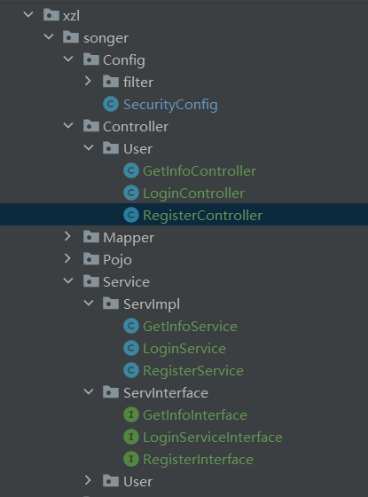

## 结构简介

1. `Service.ServInterface.xxxServiceInterface`

​			接口

2. `Service.ServImpl.xxxService`

​			服务，实现接口

3. `Controller.xxxController`

​			控制器，调用服务


## 例子

#### 登录模块

##### LoginServiceInterface

```java
package xzl.songer.Service.ServInterface;

import java.util.Map;

public interface LoginServiceInterface {
    Map<String, String> getToken(String name, String pwd);
}

```


##### LoginService

````java
package xzl.songer.Service.ServImpl;

import org.springframework.beans.factory.annotation.Autowired;
import org.springframework.security.authentication.AuthenticationManager;
import org.springframework.security.authentication.UsernamePasswordAuthenticationToken;
import org.springframework.security.core.Authentication;
import org.springframework.stereotype.Service;
import xzl.songer.Pojo.User;
import xzl.songer.Service.ServInterface.LoginServiceInterface;
import xzl.songer.Utils.Impl.UserDetailsImpl;
import xzl.songer.Utils.Jwt.JwtUtil;

import java.util.HashMap;
import java.util.Map;

@Service // 记得声明是service
public class LoginService implements LoginServiceInterface {
    
    @Autowired // 注入鉴权器
    private AuthenticationManager authenticationManager;

    @Override
    public Map<String, String> getToken(String name, String pwd) {
        
        UsernamePasswordAuthenticationToken usernamePasswordAuthenticationToken =
                new UsernamePasswordAuthenticationToken(name, pwd);
        // 生成一个鉴权token, 传入的参数是两个，是一个未授权token
        
        Authentication authenticate = authenticationManager.authenticate(usernamePasswordAuthenticationToken);
        // 进行鉴权，鉴定不通过报异常
        
        UserDetailsImpl userDetails = (UserDetailsImpl) authenticate.getPrincipal();
        // 获取登录用户
        
        User user = userDetails.getUser();
        String jwt = JwtUtil.createJWT(user.getId().toString());
        // 根据id，生成jwt
        
        Map<String, String> res = new HashMap<>();
        res.put("msg", "Success");
        res.put("token", jwt);
        return res;
    }
}

````


##### LoginController

````java
package xzl.songer.Controller.User;

import org.springframework.beans.factory.annotation.Autowired;
import org.springframework.web.bind.annotation.PostMapping;
import org.springframework.web.bind.annotation.RequestParam;
import org.springframework.web.bind.annotation.RestController;
import xzl.songer.Service.ServImpl.LoginService;

import java.util.Map;

@RestController
public class LoginController {
    @Autowired // 注入服务
    private LoginService loginService;
    @PostMapping("/login/") // 记得放行
    public Map<String, String> login(@RequestParam Map<String, String> PostInfo) {
        String name = PostInfo.get("name");
        String pwd = PostInfo.get("pwd");
        return loginService.getToken(name, pwd);
    }
}

````


##### 结构


#### 请求信息模块

根据 `token` 获取信息

用户的请求头中需要带：

````python
 Header = {
     'Authorization': 'Bearer ' + token,
 }
注意后面有空格，这个和jwtfilter对应
````

该url不需要放行


##### 文件结构


##### GetInfoInterface

````java
package xzl.songer.Service.ServInterface;

import java.util.Map;

public interface GetInfoInterface {
    public Map<String, String> getinfo();
}

````


##### GetInfoService

````java
package xzl.songer.Service.ServImpl;

import org.springframework.beans.factory.annotation.Autowired;
import org.springframework.security.core.Authentication;
import org.springframework.security.core.context.SecurityContextHolder;
import org.springframework.stereotype.Service;
import xzl.songer.Mapper.UserMapper;
import xzl.songer.Pojo.User;
import xzl.songer.Service.ServInterface.GetInfoInterface;
import xzl.songer.Utils.Impl.UserDetailsImpl;

import java.util.HashMap;
import java.util.Map;

@Service
public class GetInfoService implements GetInfoInterface {

    @Override
    public Map<String, String> getinfo() {
        // -------
        Authentication authentication = SecurityContextHolder.getContext().getAuthentication();
        UserDetailsImpl userDetails = (UserDetailsImpl) authentication.getPrincipal();
        User user = userDetails.getUser();
        // ------- 这三行可以获取当前token对应的用户
        /*
        第一行是获取当前线程的授权用户
        第二行获取用户详情
        第三行获取用户表项
        */
        Map<String, String> res = new HashMap<>();
        res.put("msg", "Success");
        res.put("name", user.getName());
        return res;
    }
}

````


##### GetInfoController

````java
package xzl.songer.Controller.User;

import org.springframework.beans.factory.annotation.Autowired;
import org.springframework.web.bind.annotation.GetMapping;
import org.springframework.web.bind.annotation.PostMapping;
import org.springframework.web.bind.annotation.RequestParam;
import org.springframework.web.bind.annotation.RestController;
import xzl.songer.Service.ServImpl.GetInfoService;
import xzl.songer.Service.ServImpl.LoginService;

import java.util.Map;

@RestController
public class GetInfoController {
    @Autowired
    private GetInfoService getInfoService;
    @GetMapping("/getinfo/") // Get，调了好久。。。
    public Map<String, String> getinfo() {
        return getInfoService.getinfo();
    }
}

````


#### 注册模块

需要放行url

##### 文件结构



##### RegisterInterface

````java
package xzl.songer.Service.ServInterface;

import java.util.Map;

public interface RegisterInterface {
    public Map<String, String> register(String name, String pwd);
}

````


##### RegisterService

````java
package xzl.songer.Service.ServImpl;

import com.baomidou.mybatisplus.core.conditions.query.QueryWrapper;
import org.springframework.beans.factory.annotation.Autowired;
import org.springframework.security.crypto.bcrypt.BCryptPasswordEncoder;
import org.springframework.security.crypto.password.PasswordEncoder;
import org.springframework.stereotype.Service;
import xzl.songer.Mapper.UserMapper;
import xzl.songer.Pojo.User;
import xzl.songer.Service.ServInterface.RegisterInterface;

import java.util.HashMap;
import java.util.Map;

@Service
public class RegisterService implements RegisterInterface {

    @Autowired
    private UserMapper userMapper;
    @Override
    public Map<String, String> register(String name, String pwd) {
        QueryWrapper<User> queryWrapper = new QueryWrapper<>();
        queryWrapper.eq("name", name);
        User user = userMapper.selectOne(queryWrapper);
        Map<String, String> res = new HashMap<>();
        /*
        还能加一下别的判断
        */
        if (user != null) {
            res.put("msg", "用户名已存在");
            return res;
        }
        PasswordEncoder passwordEncoder = new BCryptPasswordEncoder();
        userMapper.insert(new User(null, name, passwordEncoder.encode(pwd)));
        res.put("msg", "Success");
        return res;
    }
}

````


##### RegisterController

````java
package xzl.songer.Controller.User;

import org.springframework.beans.factory.annotation.Autowired;
import org.springframework.web.bind.annotation.PostMapping;
import org.springframework.web.bind.annotation.RequestParam;
import org.springframework.web.bind.annotation.RestController;
import xzl.songer.Service.ServImpl.RegisterService;

import java.util.Map;

@RestController
public class RegisterController {
    @Autowired
    private RegisterService registerService;

    @PostMapping("/register/")
    public Map<String, String> register(@RequestParam Map<String, String> rp) {
        String name = rp.get("name");
        String pwd = rp.get("pwd");
        return registerService.register(name, pwd);
    }
}

````

